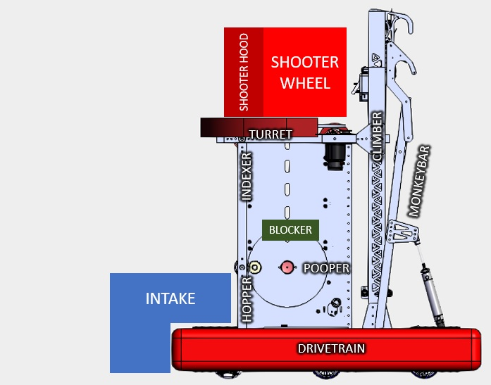

# 2022_Main_Robot

## Subsystems:

* Shooter Wheel - `Naman`  
  Controls velocity of the flywheel and rollers mounted on the hood (mechanically coupled).

  * 2x TalonFX
* Shooter Hood  
  Adjusts the hood angle to affect shot trajectory.

  * 1x TalonFX
  * 1x TalonFX limitswitch for home position / zero
* Limelight  
  For identifying and tracking the vision targets on the goal.

  * 1x Limelight
* Photonvision  
  For identifying the location of balls on the intake side of the robot during auto, color stream fed to dashboard for use during teleop by drive team.

  * 1x Photonvision
* Turret - `Katie`  
  Rotates the shooter assembly. This may not exist for our first event(s).

  * 1x TalonFX
  * 1x TalonFX limitswitch for home position / zero
* Intake roller - `Jio`  
  Acquires balls from the ground.

  * 1x TalonFX
* Intake raise/lower  
  Positions the intake assembly to the lowered position (where the rollers could pick up balls from the field),
  or the raised position (within our frame perimeter).

  * 1x Double Solenoid
* Indexer - `Conor`  
  Moves the balls through the superstructure, rollers above the hopper blocker that cause ball motion into the shooter.

  * 1x TalonFX
  * 1x Digital Input for ball detection (IR sensor)
* Hopper - `Ted`  
  Causes ball motion between the intake and indexer (in the pooper area).

  * 1x TalonFX
  * 1x Digital Input for ball detection (IR sensor)
* Hopper blocker - `Conor`  
  Prevents the ball from moving into the indexer to aid in alignment for pooper.

  * 1x Double Solenoid
* Pooper - `Ted`  
  Spits balls out of the robot that don't match our alliance color.

  * 1x Double Solenoid to eject ball
* Pixy / Color-sensor  
  Determines if the ball in the hopper area matches our alliance color.
  
  Wiring map:
  

  * Pixy2 / color-sensor for ball color detection
* Climber - `Aiden`  
  Linear lift that can raise/lower to perform the climb.

  * 2x TalonFX
  * 1x TalonFX limitswitch for home position / zero
  * 1x DigitalInput for bar detection
* MonkeyBar  
  Passively engages the bars when climbing. Pivots to tilt the robot to aid the `Climber` in engaging the next rung.

  * 1x Double Solenoid for pivot
  * 1x DigitalInput for bar detection
* Drivetrain - `Nate`  
  * 6x TalonFX
  * 1x Pigeon IMU

## Guidelines for contributors

See [Contributing.md](/CONTRIBUTING.md)
