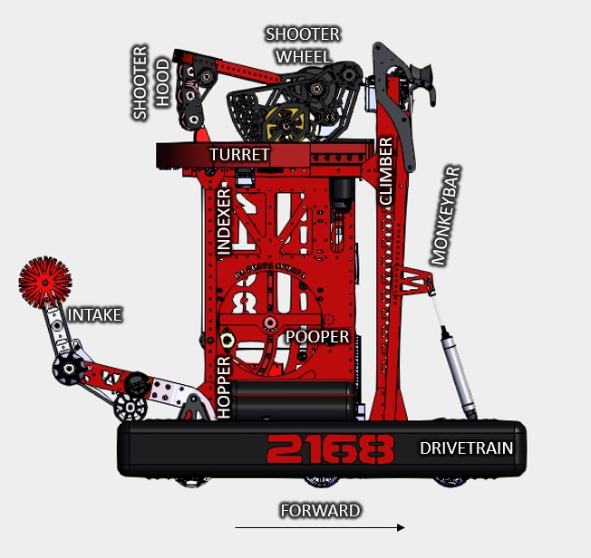

# 2022_Main_Robot

## Subsystems:

* Shooter Wheel - `Naman`
  * 2x TalonFX
* Shooter Hood
  * 1x TalonFX
  * 1x TalonFX limitswitch for home position / zero
* Limelight
  * 1x Limelight
* Photonvision
  * 1x Photonvision
* Turret - `Katie`
  * 1x TalonFX
  * 1x TalonFX limitswitch for home position / zero
* Intake roller - `Jio`
  * 1x TalonFX
* Intake raise/lower
  * 1x Double Solenoid
* Indexer - `Conor`
  ball motion preceeding the shooter

  * 1x TalonFX
  * 1x Digital Input for ball detection (IR sensor)
* Hopper - `Ted`
  ball motion between the intake and indexer (in the pooper area)

  * 1x TalonFX
  * 1x Digital Input for ball detection (IR sensor)
* Hopper blocker - `Conor`
  Prevents the ball from moving into the indexer to aid in alignment for pooper

  * 1x Double Solenoid
* Pooper - `Ted`
  * 1x Double Solenoid to eject ball
* Pixy / Color-sensor
  * Pixy2 / color-sensor for ball color detection
* Climber - `Aiden`
  * 2x TalonFX
  * 1x TalonFX limitswitch for home position / zero
  * 1x DigitalInput for bar detection
* MonkeyBar
  * 1x Double Solenoid for pivot
  * 1x DigitalInput for bar detection
* Drivetrain - `Nate`
  * 6x TalonFX
  * 1x Pigeon IMU

## Guidelines for contributors

See [Contributing.md](/CONTRIBUTING.md)
